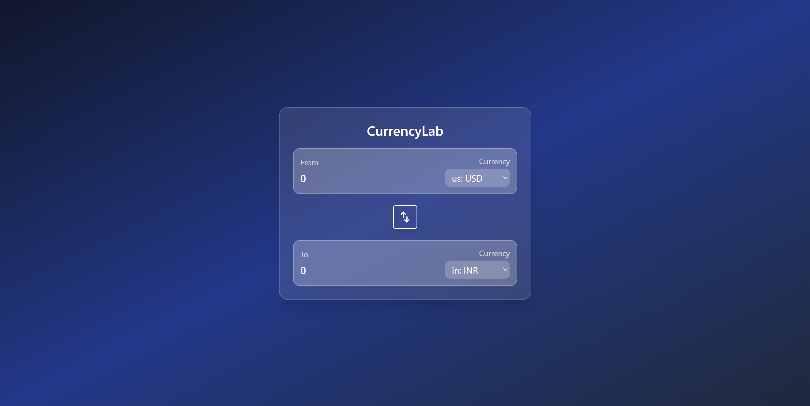

# CurrencyLab

CurrencyLab is a modern, real-time currency converter built with React.
It focuses on simplicity, speed, and clean user experience while demonstrating strong fundamentals of state-driven UI and custom hooks.

## Inspiration

CurrencyLab started as a learning project while exploring React fundamentals and UI design.

While building small tools, I noticed, many converters rely on manual actions (buttons), UI often feels outdated or cluttered,
and real-time feedback is missing.

I wanted to build something that reacts instantly to user input, feels smooth and modern, and reflects how real-world fintech interfaces behave.

That idea became CurrencyLab.

## Live Demo
[Click Here](https://currency-lab.vercel.app/)
## Preview


## Features
- Real-time currency conversion

- Instant conversion as the user updates amount or currency; no button required.

- Currency flags for better visual representation

- Seamlessly swap currencies with a smooth rotating animation and synced value update.

- Live exchange rates

- Fetches real-time currency data dynamically using an external API.

- Derived state architecture: converted values are computed dynamically instead of stored; ensuring accuracy and simplicity.

- Keyboard-friendly input; Press Enter to trigger conversion.

- Prevents invalid inputs like negative values and scientific notation

- Modern UI (Glassmorphism)
    - Soft blurred card layout
    - Gradient background
    - Clean typography and spacing
    - Smooth micro-interactions
    - Responsive design
    - Optimized for mobile, tablet, and desktop screens.

## Technical Highlights
- Custom React Hook (useCurrencyInfo) for API abstraction
- State-driven UI rendering
- Derived state (no redundant state storage)
- Controlled components for form inputs
- Event handling for keyboard interactions
- Separation of concerns (UI vs logic)
- Responsive layout with Tailwind CSS

This project reflects core React concepts such as:
- unidirectional data flow
- component reusability
- state vs derived values
- side effects with useEffect
- clean UI composition

## Tech Stack
- React (Vite)
- JavaScript (ES6+)
- Tailwind CSS
- Currency API (https://latest.currency-api.pages.dev/v1/currencies/usd.json)<br>

## Project Structure
CurrencyLab/<br>
├── src/<br>
│   ├── components/<br>
│   │   └── InputBox.jsx<br>
│   ├── hooks/<br>
│   │   └── useCurrencyInfo.js<br>
│   ├── App.jsx<br>
│   └── main.jsx<br>
├── public/<br>
│   └── swap.svg<br>
└── README.md


## How to Run Locally
1. Clone the repository
```
git clone https://github.com/sagarpani/currencyLab.git
```
2. Install dependencies
```
npm install
```
3. Start development server
```
npm run dev
```

## Future Improvements
- Exchange rate trends / charts
- Favorite currencies
- Conversion history
- Offline caching using localStorage
- Dark / Light mode toggle
- React Native (Expo) version

## Author
Sagar Pani<br>
LinkedIn: [Sagar Pani](https://www.linkedin.com/in/sagarpani/)

FullStack Developer (in progress)<br>
Learning ReactJs + Vite, Tailwind<br>
Building projects to learn deeply, not just to make them work.